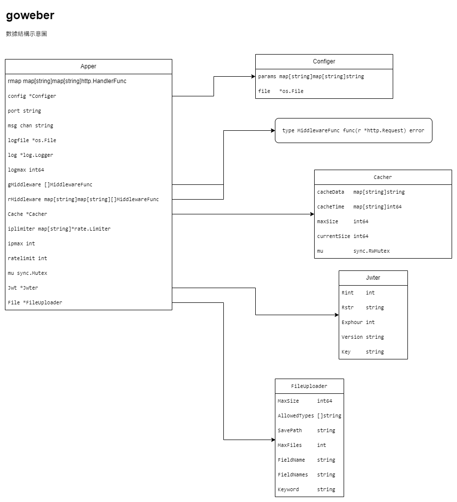

# goweber

#### 介绍
goweber是一個GO編寫的WEB框架，主要用於API服務。
支持功能：
- 路由
- 日志服務
- 配置服务
- 基於IP的限流
- 中間件服務，支持全局和路由級
- 支持JWT

#### 數據結構



#### 安装教程

```shell
go get github.com/sonkwl/goweber
```

#### 使用说明

```go
package goweber

import (
    "fmt"
    "net/http"
    "github.com/sonkwl/goweber"
)
func main() { 
    app := goweber.New()
    app.Get("/", func(w http.ResponseWriter, r *http.Request) { 
        fmt.Fprintf(w, "Hello World!")
    })
    app.Run()
}

```

#### 配置文件
請保證config.ini在執行文件同目錄下
```ini
[server]
# 網站端口
# Website port
port = 8080

#  網絡日誌 logfile:目錄，logmax:文件最大大小
# Network log logfile: directory, logmax: maximum file size
logfile = access.log
logmax = 1024000000

# 緩存器，單位Mb
# Cache, unit Mb
# apper中有Cache结构指针
# apper has Cache structure pointer
cache = 1

# 限流 ipmax監控最大IP數量>0，開啓限流，ratelimit每秒訪問次數
# Rate limiting ipmax: maximum number of monitored IPs > 0, enable rate limiting, ratelimit: visits per second
ipmax=1000
ratelimit=10

# apper中有Jwt结构指针
# apper has Jwt structure pointer
[jwt]
rint = 1
rstr = WHSS
version = V1
exp = 8

# apper中有File结构指针
# apper has File structure pointer
[file]
# 单位MB
# Unit MB
size = 20
# 最大批量上传数量
# Maximum batch upload quantity
max = 2
# 文件保存目录
# File save directory
path = ./files
# 文件类型
# File types
type = .jpg,.png
```